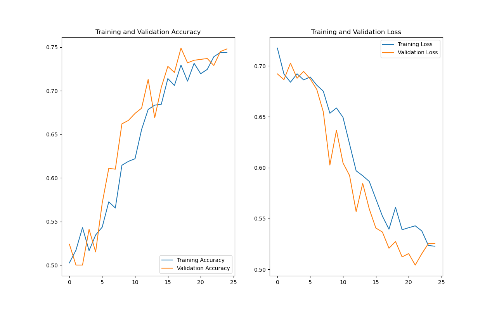

# 🐱 Animal Classification Model

A deep learning project for classifying images of cats and dogs using a Convolutional Neural Network (CNN) implemented with TensorFlow.

## Overview 🔍

This project downloads, prepares and augments image datasets, builds a CNN model, trains it on the prepared data, and saves the trained model. It also provides visualizations of training and validation metrics.

## Project Structure 📁

- **train.py**: The main script that downloads data, creates image generators, builds and trains the CNN model, and plots the results.
- **cats_and_dogs_filtered/**: Directory containing image data separated into training and validation sets.
- **README.md**: Project documentation.

## Prerequisites ⚙️

- Python 3.x
- TensorFlow
- NumPy
- Matplotlib
- (Optional) GPU support for faster training

## Installation 💻

1. Clone the repository:
   ```bash
   git clone https://github.com/kassoumsanogo1/Animal-Classification-tf-keras.git
   ```
2. Create and activate a virtual environment:
   ```bash
   python -m venv venv
   source venv/bin/activate  # On Mac
   source venv\Scripts\activate # On Windows
   ```
3. Install the required packages:
   ```bash
   pip install tensorflow numpy matplotlib
   ```
4. Code to download Small DataSet
   ```python
    import tensorflow as tf
    _URL = 'https://storage.googleapis.com/mledu-datasets/cats_and_dogs_filtered.zip'
    zip_dir = tf.keras.utils.get_file('cats_and_dogs_filtered.zip', origin=_URL, extract=True)
    print("Path to dataset files:", zip_dir)
    ```
5. Code to download Big Dataset
    ```python
    import kagglehub
    path = kagglehub.dataset_download("bhavikjikadara/dog-and-cat-classification-dataset")
    print("Path to dataset files:", path)
    ```

## Usage 🚀

Run the training script:
```bash
python train.py
```

To Test your Model:
```bash
python main_use_model.py
```

The script will:
- Download and prepare the dataset.
- Create augmented image generators.
- Build and train the CNN model.
- Save the trained model as `cats_dogs_model.h5`.
- Plot the training and validation accuracy and loss.

## Training Curve 📈

  <!-- Replace with your image path -->

## Customization ✏️

Adjust training parameters such as batch size, epochs, or image size by modifying the constants in `train.py`.

## License 📜

This project is licensed under the MIT License. See the [LICENSE](LICENSE) file for details.

## Contact 📞

Provide your contact information or GitHub profile link for any questions or contributions.
